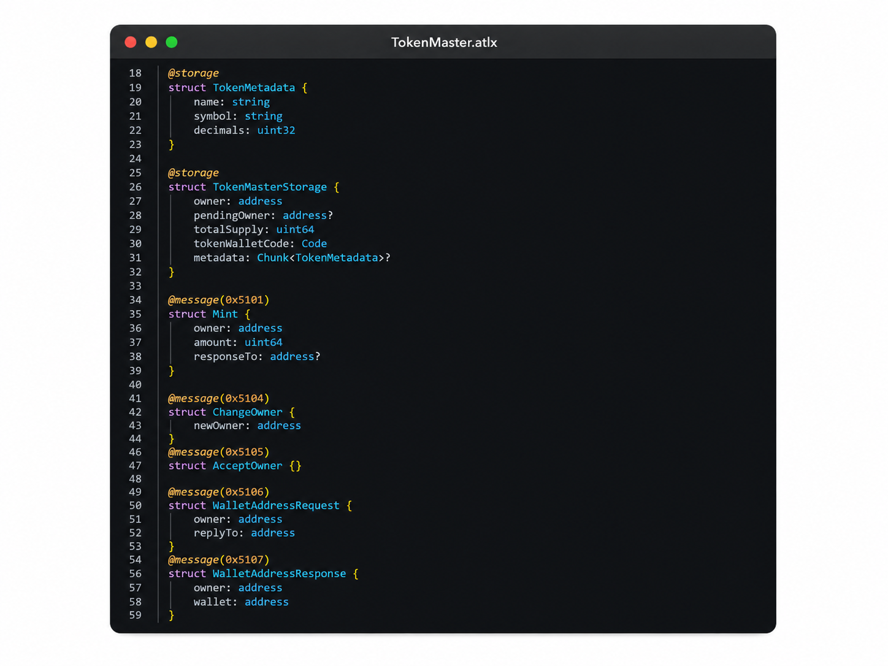
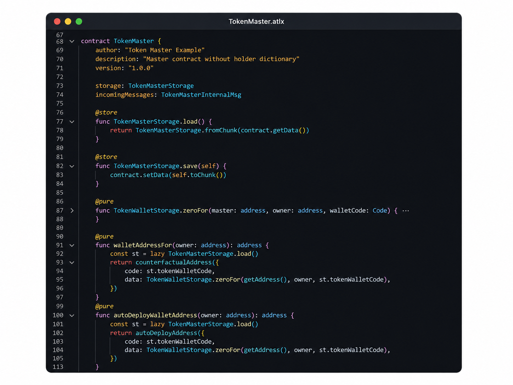

<p align="center">
  
</p>

# Aetralis Language

[](https://marketplace.visualstudio.com/items?itemName=softwaremaestro.aetralis-language&ssr=false#overview)

Editor support for Aetralis smart contracts (`.atlx`) in Visual Studio Code.

**[Install it from the VS Code Marketplace →](https://marketplace.visualstudio.com/items?itemName=softwaremaestro.aetralis-language&ssr=false#overview)**

## Features

- **Theme-independent syntax highlighting** — every construct gets its own fixed color via `configurationDefaults`, so `.atlx` files look the same in any theme.
- **Hover documentation** for annotations, send modes, `buildMessage` fields like `mode` and `textComment`, dictionary types like `Map<K, V>`, canonical `uint*/int*` widths plus bare `uint` / `int` aliases, reserved handler names, builtins, and anything you've declared yourself (structs, enums, type aliases, functions, consts, and local `var`/`const` bindings).
- **Workspace-aware completion** — the language's own vocabulary plus every symbol declared anywhere in your open workspace, including your own functions and variables. Type the start of a name you've already used and accept the suggestion with Tab or a click.
- **Go to Definition** (Ctrl+Click / F12), resolving across files pulled in via `import`.
- **Diagnostics** mirroring the compiler's rules for message handlers (`@internal` / `@external` / `@bounced`), `buildMessage.mode`, and legacy/removed syntax.
- **Live symbol substitution** — `!=`, `=>`, `<=`, and `>=` turn into `≠`, `⇒`, `≤`, `≥` the instant you finish typing them; it's skipped automatically inside strings and comments.
- **Comment-aware coloring** — brackets that appear inside a `//` or `/* */` comment are always colored as comment text (never as stray highlighted punctuation), and inline code wrapped in backticks inside a comment (`` `like this` ``) renders in italics.

## Outbound Messages

`buildMessage({...})` builds the outbound envelope. `mode:` and `textComment:` are optional, and the finished message is sent with `.send()` without any arguments.

```atlx
const out = buildMessage({
    receiver: dest,
    amount: 0,
    bounce: BounceMode.NoBounce,
    body: Ping {
        amount: 1,
    },
    mode: SEND_DRAIN_BALANCE + SEND_DESTROY_IF_EMPTY,
    textComment: "vault closed",
})
out.send()
```

## Screenshots





## Requirements

Visual Studio Code 1.85 or later.

## Installation

Install **Aetralis Language** [from the Marketplace](https://marketplace.visualstudio.com/items?itemName=softwaremaestro.aetralis-language&ssr=false#overview), or install a downloaded `.vsix` package via **Extensions → ... → Install from VSIX**. Any file with the `.atlx` extension is recognized automatically.

## Development

The extension has no build step — `extension.js` and `src/*.js` run directly. To package a `.vsix`:

```
npm run package
```

This uses [`@vscode/vsce`](https://github.com/microsoft/vscode-vsce) and packages `docs/marketplace-readme.md` as the extension's Marketplace overview page (a shorter, more general description than this file).

## Contributing

Issues and pull requests are welcome at the [repository](https://github.com/Aetra-Network/Aetralis-Extension).

## License

Released under the [MIT License](LICENSE) — the license applies to this extension's source code. "Aetralis" and "ATLX", along with the associated logo, are marks of Aetra Network and are not covered by the MIT grant.
